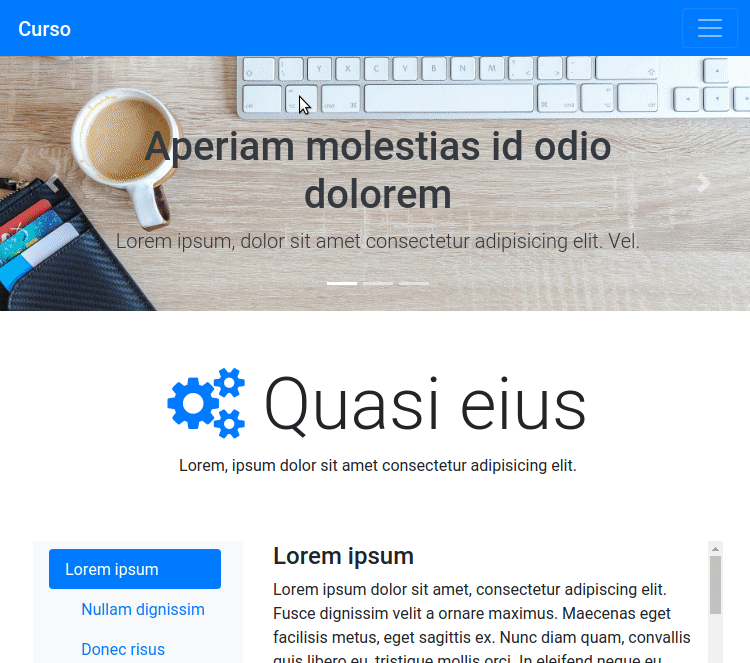

<h2 align="center">
Curso criando um site com Bootstrap 4
</h2>

  

<h3 align="center">  
  <a href="#information_source-sobre">Sobre</a> |
  <a href="#interrobang-motivo">Motivo</a> | 
  <a href="#rocket-tecnologias-utilizadas">Tecnologias</a> | 
  <a href="#link-como-contribuir">Como Contribuir</a> | 
  <a href="#licença">Licença</a> 
</h3>

## :information_source: Sobre

Os códigos deste repositório é referente ao curso que encontrei no YouTube no canal [Ricardo Sanches](https://www.youtube.com/channel/UCxsjItE8ek_KG21BClqBo7Q). Playlist: Criando um site com Bootstrap 4. Disponível em: [https://www.youtube.com/playlist?list=PLBbHLUbqqCrTwIrdix6kl84m4OPE0JexR](https://www.youtube.com/playlist?list=PLBbHLUbqqCrTwIrdix6kl84m4OPE0JexR).

## :interrobang: Motivo

Aprender a utilizar o framework Bootstrap na versão 4.

## :rocket: Tecnologias Utilizadas

O projeto foi desenvolvido utilizando as seguintes tecnologias

- [HTML](https://developer.mozilla.org/pt-BR/docs/Web/HTML)
- [CSS](https://developer.mozilla.org/pt-BR/docs/Web/CSS)
- [JavaScript](https://developer.mozilla.org/pt-BR/docs/Web/JavaScript)
- [Bootstrap 4](https://getbootstrap.com)

## :link: Como contribuir

- Faça um Fork do repositório,
- Faça um clone do respositório
- Crie uma branch com a sua feature
- Faça um commit com suas mudanças
- Push a sua branch
- Ir em Pull Requests do projeto original e criar uma pull request com o seu commit

## Licença
Esse projeto está sob a licença MIT. Veja o arquivo [LICENSE](LICENSE) para mais detalhes.